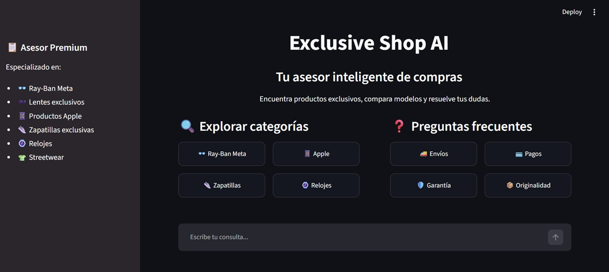
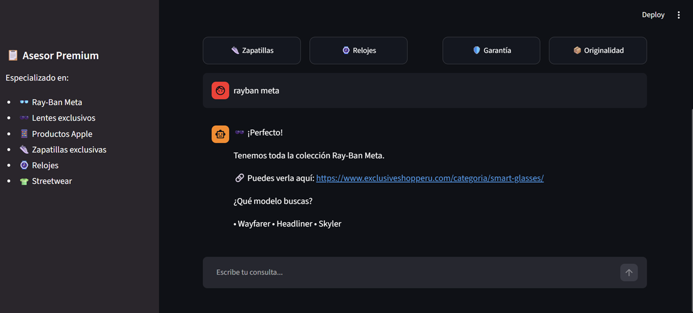
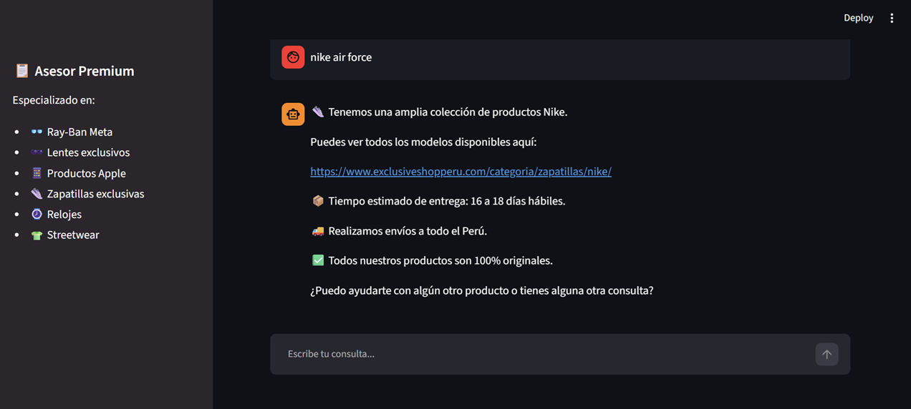
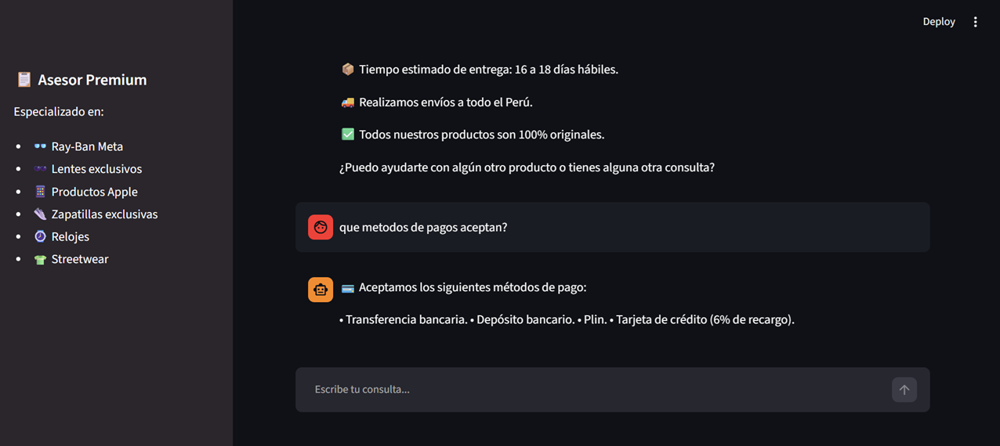
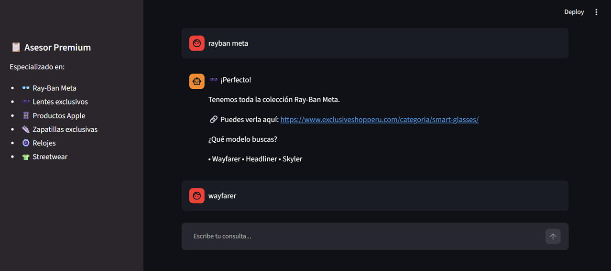
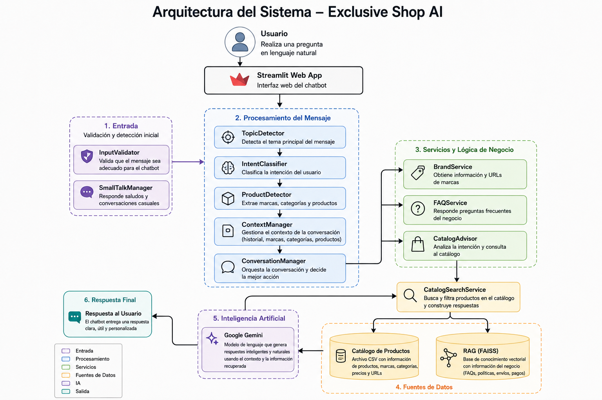

# 🛍️ Exclusive Shop AI

Asistente inteligente para comercio electrónico desarrollado con *Python*, *LangChain*, *Google Gemini* y *Retrieval-Augmented Generation (RAG)*.

Diseñado para ayudar a los clientes a encontrar productos, responder consultas y brindar recomendaciones personalizadas mediante conversaciones en lenguaje natural.

---

# 🎯 Objetivo del Proyecto

Desarrollar un asistente inteligente para e-commerce capaz de comprender consultas en lenguaje natural, recomendar productos, responder preguntas frecuentes y mejorar la experiencia de compra mediante Inteligencia Artificial Generativa.

El proyecto demuestra cómo combinar modelos de lenguaje, búsqueda semántica y un catálogo de productos para ofrecer una experiencia conversacional más natural y útil para los clientes.

---

# 📖 Descripción

Exclusive Shop AI es un asistente inteligente para comercio electrónico que combina *Inteligencia Artificial Generativa*, *Procesamiento de Lenguaje Natural (NLP)* y *Retrieval-Augmented Generation (RAG)* para ayudar a los clientes a encontrar productos mediante conversaciones naturales.

A diferencia de un chatbot tradicional, el asistente comprende el contexto de la conversación, detecta la intención del usuario, identifica marcas, categorías y productos automáticamente, consulta un catálogo de productos y genera respuestas utilizando Google Gemini.

---

# ✨ Características

- 🤖 Asistente conversacional impulsado por IA
- 🧠 Inteligencia Artificial Generativa con Google Gemini
- 📚 Retrieval-Augmented Generation (RAG)
- 🔍 Búsqueda semántica mediante embeddings
- 🛍️ Motor inteligente de recomendación de productos
- 🏷️ Detección automática de marcas
- 📦 Detección automática de categorías
- 📱 Detección de productos mediante lenguaje natural
- 💬 Conversaciones con memoria contextual
- 🎯 Clasificación de intención del usuario
- 🔗 Enrutamiento inteligente hacia categorías y marcas
- ❓ Respuestas automáticas para preguntas frecuentes (FAQ)
- 📊 Arquitectura modular
- ⚡ Recuperación rápida de información
- 🌐 Interfaz web desarrollada con Streamlit

---

# 🖥️ Capturas de Pantalla

## Inicio

---

## Chat

---

## Recomendación de Productos

---

## Preguntas Frecuentes

---

## Memoria Conversacional

---

# 🏗️ Arquitectura del Sistema

---

# 🔄 Flujo de la Aplicación

text
                 Usuario
                     │
                     ▼
                SalesAgent
                     │
      ┌──────────────┼──────────────┐
      ▼              ▼              ▼
Intent        ProductDetector   Context
Classifier                      Manager
                     │
                     ▼
          Conversation Manager
                     │
      ┌──────────────┼────────────────┐
      ▼              ▼                ▼
BrandService   CategoryService   CatalogSearchService
                                         │
                         ┌───────────────┴──────────────┐
                         ▼                              ▼
                  Catálogo de Productos               RAG
                                                         │
                                                         ▼
                                                  Google Gemini
                                                         │
                                                         ▼
                                          Respuesta en lenguaje natural

---

# 🧠 Pipeline RAG

text
Pregunta del Usuario
        │
        ▼
Embeddings
        │
        ▼
Base Vectorial (FAISS)
        │
        ▼
Retriever
        │
        ▼
Contexto Relevante
        │
        ▼
Prompt Builder
        │
        ▼
Google Gemini
        │
        ▼
Respuesta Generada

---

# 📂 Estructura del Proyecto

text
app/
│
├── agents/
├── advisors/
├── api/
├── constants/
├── loaders/
├── prompts/
├── retrievers/
├── router/
├── services/
├── ui/
├── utils/
├── validators/
│
├── chatbot.py
├── rag.py
├── vectorstore.py
├── retriever.py
├── embeddings.py
├── llm.py
└── config.py

---

# 🛠️ Tecnologías Utilizadas

| Tecnología | Descripción |
|------------|-------------|
| Python | Backend |
| Streamlit | Interfaz Web |
| Google Gemini | Inteligencia Artificial Generativa |
| LangChain | Orquestación de IA |
| FAISS | Base de datos vectorial |
| Sentence Transformers | Embeddings |
| Pandas | Procesamiento del catálogo |

---

# 🚀 Instalación

## Clonar el repositorio

git clone https://github.com/oscarcruz-ai/exclusive-shop-ai.git

## Ingresar al proyecto

cd exclusive-shop-ai

## Crear un entorno virtual

python -m venv .venv

## Activar el entorno virtual

### Windows

.venv\Scripts\activate

## Instalar dependencias

pip install -r requirements.txt

## Ejecutar la aplicación

streamlit run streamlit_app.py

---

# 💬 Ejemplos de Consultas

El asistente puede responder preguntas como:

text
Muéstrame las Ray-Ban Meta

Quiero unas zapatillas Nike

Nike Air Force 1

Adidas Samba

Jordan Retro 1

¿Qué productos Apple tienen?

MacBook Air

Muéstrame unos lentes de sol

¿Qué métodos de pago aceptan?

¿Cuánto demora el envío?

¿Qué marcas venden?

Muéstrame relojes Swatch

Recomiéndame unas zapatillas premium

---

# 🧪 Capacidades de Inteligencia Artificial

El asistente es capaz de:

- Comprender lenguaje natural.
- Detectar la intención del usuario.
- Identificar marcas automáticamente.
- Detectar categorías de productos.
- Identificar productos específicos.
- Mantener el contexto de la conversación.
- Comprender preguntas relacionadas con mensajes anteriores.
- Consultar información mediante búsqueda semántica.
- Responder preguntas frecuentes.
- Recomendar productos.
- Enrutar automáticamente consultas hacia categorías y marcas.
- Generar respuestas utilizando Google Gemini.

---

# 📈 Mejoras Futuras

- Integración con la API de WooCommerce.
- Integración con WhatsApp Business.
- Sincronización de inventario en tiempo real.
- Actualización automática de precios.
- Comparación inteligente de productos.
- Recomendaciones personalizadas.
- Asistente por voz.
- Seguimiento de pedidos.

---

# 🎓 Proyecto Académico

Proyecto desarrollado como parte del desafío de *Oracle Next Education (ONE)* y *Alura Latam*.

Este proyecto demuestra la implementación de:

- Inteligencia Artificial Generativa.
- Retrieval-Augmented Generation (RAG).
- Procesamiento de Lenguaje Natural (NLP).
- Búsqueda Semántica.
- IA Conversacional.
- Arquitectura de Software Modular.

---

# 👨‍💻 Autor

*Oscar Cruz Salvador*

GitHub: https://github.com/oscarcruz-ai

---

# ⭐ Agradecimientos

- Google Gemini
- LangChain
- Streamlit
- FAISS
- Oracle Next Education
- Alura Latam