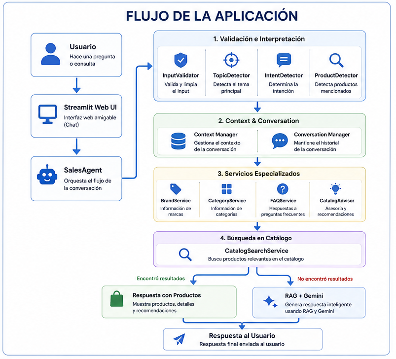
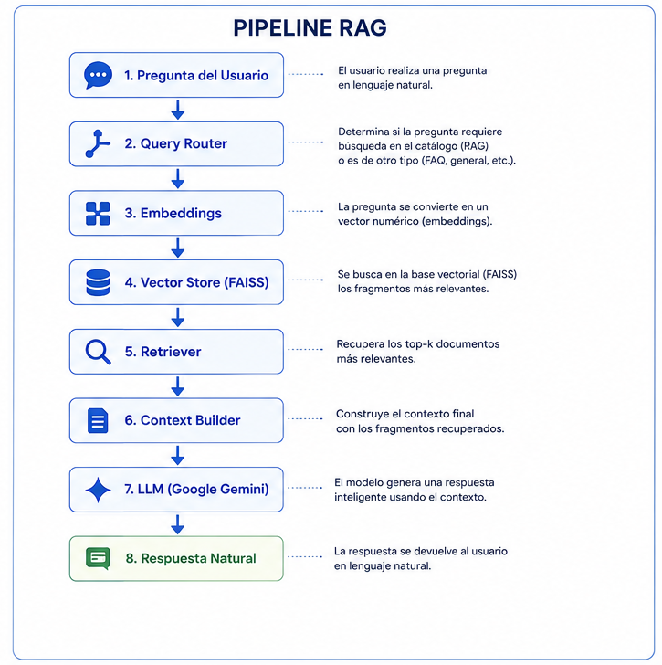
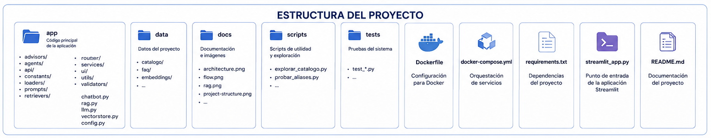

# 🛍️ Exclusive Shop AI

Asistente inteligente de compras desarrollado con *Python*, *FastAPI*, *LangChain*, *Google Gemini* y *Retrieval-Augmented Generation (RAG)*.

Diseñado para ayudar a los clientes de *Exclusive Shop* mediante Inteligencia Artificial, recomendando productos y respondiendo consultas en lenguaje natural.

---

# 🚀 Demo en Vivo

| Servicio | URL |
|----------|-----|
| 💬 Chat IA | https://chat.exclusiveshopperu.com |
| 📘 API Swagger | https://api.exclusiveshopperu.com/docs |
| 🛒 Tienda Online | https://www.exclusiveshopperu.com |

---

# 📖 Descripción

Exclusive Shop AI es un asistente inteligente de compras que combina *Inteligencia Artificial Generativa*, *Procesamiento de Lenguaje Natural (NLP)* y *Retrieval-Augmented Generation (RAG)* para ayudar a los clientes a encontrar productos mediante conversaciones naturales.

El asistente comprende la intención del usuario, identifica marcas, categorías y productos, consulta el catálogo de la tienda y genera respuestas inteligentes utilizando Google Gemini.

---

# ✨ Características

- 🤖 Asistente conversacional con IA
- 🧠 Integración con Google Gemini
- 📚 Retrieval-Augmented Generation (RAG)
- 🔍 Búsqueda semántica con FAISS
- 🛍️ Recomendación inteligente de productos
- 🏷️ Detección automática de marcas
- 📦 Detección de categorías
- 💬 Memoria conversacional
- ❓ Preguntas frecuentes
- 🌐 API REST con FastAPI
- 💻 Interfaz Web con Streamlit
- 🐳 Contenedores Docker
- ☁️ Despliegue en Oracle Cloud
- 🔒 HTTPS con Let's Encrypt

---

# 🖥️ Capturas de Pantalla

## Inicio

---

## Chat

---

## Recomendación de Productos

---

## Preguntas Frecuentes

---

## Memoria Conversacional

---

# 🏗️ Arquitectura del Sistema

---

# 🔄 Flujo de la Aplicación

---

# 🧠 Pipeline RAG

---

# ☁️ Arquitectura de Despliegue

- Oracle Cloud Infrastructure (OCI)
- Docker Compose
- FastAPI
- Streamlit
- FAISS
- Google Gemini
- LangChain
- Nginx Reverse Proxy
- HTTPS con Let's Encrypt

---

# 🛠️ Tecnologías Utilizadas

| Tecnología | Uso |
|------------|-----|
| Python | Backend |
| FastAPI | API REST |
| Streamlit | Interfaz Web |
| LangChain | Orquestación |
| Google Gemini | LLM |
| FAISS | Base Vectorial |
| Docker | Contenedores |
| Nginx | Reverse Proxy |
| Oracle Cloud | Despliegue |
| Pandas | Procesamiento del catálogo |

---

# 📂 Estructura del Proyecto

---

# 🚀 Instalación

## Clonar el repositorio

git clone https://github.com/oscarcruz-ai/exclusive-shop-ai.git

## Entrar al proyecto

cd exclusive-shop-ai

## Crear entorno virtual

python -m venv .venv

## Activar entorno

### Windows

.venv\Scripts\activate

### Linux / macOS

source .venv/bin/activate

## Instalar dependencias

pip install -r requirements.txt

## Ejecutar Streamlit

streamlit run streamlit_app.py

## Ejecutar la API

uvicorn app.api.main:app --reload

---

# 🐳 Docker

Construir el proyecto

docker compose up -d --build

---

# 💬 Ejemplos de Consultas

text
Muéstrame lentes Ray-Ban Meta

¿Qué productos Apple tienen?

Quiero un iPhone 17 Pro

¿Tienen zapatillas Nike?

Muéstrame zapatillas Adidas

¿Cuáles son los métodos de pago?

¿Cuánto demora el envío?

¿Qué marcas venden?

Recomiéndame unas zapatillas premium

---

# 🧠 Capacidades del Asistente

- Comprende lenguaje natural.
- Detecta la intención del usuario.
- Identifica productos, marcas y categorías.
- Mantiene el contexto de la conversación.
- Responde preguntas frecuentes.
- Consulta el catálogo mediante búsqueda semántica.
- Genera respuestas con Google Gemini.
- Recomienda productos relevantes.

---

# 🗺️ Roadmap

- [x] Chat IA
- [x] API REST
- [x] Streamlit
- [x] FastAPI
- [x] Docker
- [x] Oracle Cloud
- [x] HTTPS
- [x] Dominio personalizado
- [ ] WooCommerce API
- [ ] Inventario en tiempo real
- [ ] Comparador inteligente
- [ ] WhatsApp Business
- [ ] Recomendaciones personalizadas
- [ ] Asistente por voz

---

# 🎓 Proyecto Académico

Desarrollado como parte del *Challenge de Inteligencia Artificial* de *Oracle Next Education (ONE)* y *Alura Latam*.

Este proyecto demuestra la implementación de:

- Inteligencia Artificial Generativa
- Retrieval-Augmented Generation (RAG)
- Procesamiento de Lenguaje Natural (NLP)
- IA Conversacional
- Búsqueda Semántica
- Arquitectura Modular
- Despliegue en Oracle Cloud

---

# 👨‍💻 Autor

*Oscar Cruz Salvador*

- GitHub: https://github.com/oscarcruz-ai
- 💬 Chat IA: https://chat.exclusiveshopperu.com
- 🛒 Sitio web: https://www.exclusiveshopperu.com
- 📘 API: https://api.exclusiveshopperu.com/docs

---

# ⭐ Agradecimientos

- Google Gemini
- LangChain
- Streamlit
- FastAPI
- FAISS
- Docker
- Oracle Cloud Infrastructure
- Oracle Next Education
- Alura Latam